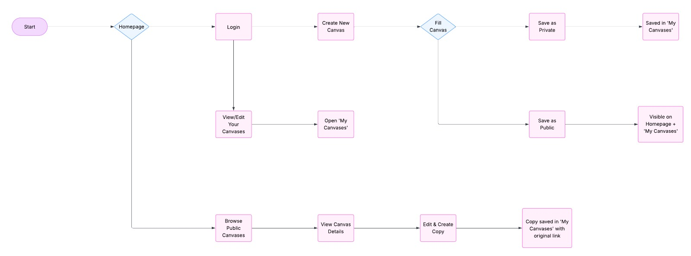

# AI Framework Repository

## Table of Contents


1. Introduction
2. Problem statement
3. Methodology
4. Architecture
5. Setup Instructions
6. Usage (Web + Local)
7. Sample Results
8. Limitations & Future Work
9. Technologies Used
10. References

## Introduction

As artificial intelligence (AI) continues to permeate various sectors, the need for structured AI education in academic curricula has become more pressing. Educators are increasingly required to integrate AI concepts into their teaching but often lack the resources and collaborative tools necessary for effective implementation. This gap highlights the necessity for a platform that supports educators in developing and sharing AI curricula.

## Problem Statement


Educators face challenges in effectively integrating AI into their curricula due to the lack of a centralized, collaborative platform. This absence leads to inconsistent AI education and missed opportunities for shared learning and resource optimization. There is a need for a dedicated platform that allows educators to collaboratively create, modify, and share AI curriculum frameworks, thereby enhancing the quality and accessibility of AI education.


## Methodology

The framework employs a **progressive disclosure methodology** with three interconnected stages:

1. **Domain Analysis (Stage 1)**: Understanding AI applications within the specific subject domain
2. **Environment Assessment (Stage 2)**: Evaluating learners, instructors, and institutional support
3. **Implementation Planning (Stage 3)**: Defining learning outcomes, assessment methods, and activities

Each stage must be completed before the next becomes available, ensuring systematic and thorough planning. The methodology is based on instructional design principles and incorporates best practices from AI education research.

## Architecture

### Frontend Architecture
- **React 18** with TypeScript for type-safe component development
- **Vite** for fast development and building
- **Tailwind CSS** for responsive styling
- **shadcn/ui** for consistent UI components
- **Zustand** for state management
- **React Router** for navigation

### Backend Architecture
- **Supabase** for backend services
  - PostgreSQL database for data persistence
  - Authentication and user management
  - Real-time subscriptions
- **Row Level Security (RLS)** for data protection

### Key Components
```
src/
├── components/
│   ├── AICoursePlanningCanvas.tsx    # Main canvas component
│   ├── CanvasItem.tsx                # Individual form fields
│   ├── CanvasSection.tsx             # Section containers
│   └── RichTextEditor.tsx            # Rich text editing
├── store/
│   └── canvas-store.ts               # Global state management
├── services/
│   └── canvas.service.ts             # API interactions
└── pages/
    ├── HomePage.tsx                  # Canvas gallery
    └── CanvasPage.tsx                # Canvas editor
```

## Setup Instructions

### Prerequisites
- Node.js (v18 or higher)
- npm or yarn package manager
- Supabase account (for backend services)

### Local Development Setup

1. **Clone the repository**
   ```bash
   git clone <repository-url>
   cd AI-education-repo
   ```

2. **Install dependencies**
   ```bash
   npm install
   ```

3. **Environment Configuration**
   Create a `.env.local` file in the root directory:
   ```env
   VITE_SUPABASE_URL=your_supabase_project_url
   VITE_SUPABASE_ANON_KEY=your_supabase_anon_key
   ```

4. **Database Setup**
   - Create a new Supabase project
   - Run the provided SQL migrations to set up tables
   - Configure Row Level Security policies

5. **Start the development server**
   ```bash
   npm run dev
   ```

6. **Access the application**
   Open [http://localhost:5173](http://localhost:5173) in your browser

### Production Deployment

The application is deployed on:

- **Netlify**: Connected with our GitHub repository for automatic deployments
- **https://educational-ai-framework-repo.netlify.app/** : Open this link to access the platform

```bash
npm run build
npm run preview  # Test production build locally
```

## Usage

### Web Application Usage

#### Creating a New Canvas
1. Navigate to the home page
2. Click "Create New Canvas"
3. Enter course title and description
4. Begin filling out the progressive sections

#### Progressive Section Completion
- **Stage 1 - AI in the Domain**: Always available for editing
  - Define the subject domain
  - Identify potential AI use cases
  - Analyze available data
  - Consider ethical implications
  - List additional learning resources

- **Stage 2 - Learning Environment**: Unlocks after Stage 1 completion
  - Assess learner prerequisites and goals
  - Evaluate instructor capabilities
  - Review institutional support

- **Stage 3 - Course Implementation**: Unlocks after Stage 2 completion
  - Define learning outcomes
  - Plan assessment strategies
  - Design learning activities

#### Flowchart of the web application:


#### Canvas Management
- **Save Changes**: Automatic saving in view mode, manual save in edit mode
- **Visibility Control**: Toggle between public and private canvases
- **Version Management**: Track different versions of your canvas
- **Collaboration**: Share public canvases with other educators

### Local Development Usage

#### Running Tests
```bash
npm run test
```

#### Code Quality
```bash
npm run lint
npm run type-check
```

#### Building for Production
```bash
npm run build
```

## Sample Results

### Example Canvas: "Predictive Maintenance for Engineers"
![[Screenshot.jpg]]

## Limitations & Future Work

### Current Limitations
1. **Collaboration Features**: Basic sharing without real-time collaboration
2. **Assessment Tools**: No built-in assessment generation
3. **Analytics**: Limited usage analytics and progress tracking
4. **Mobile Experience**: Optimized for desktop use

### Future Enhancements
1. **Real-time Collaboration**: Live editing with multiple users
2. **AI Assistant**: Intelligent suggestions based on domain and context
3. **Integration Capabilities**: LMS integration (Moodle, Canvas, Blackboard)
4. **Analytics Dashboard**: Detailed usage statistics and learning analytics
5. **Mobile Application**: Dedicated mobile app for on-the-go editing
6. **Export Capabilities**: PDF, Word, and syllabus format exports

## Technologies Used

### Frontend Technologies
- **React 18.3.1** - Modern React with hooks and functional components
- **TypeScript** - Type-safe JavaScript development
- **Vite** - Fast build tool and development server
- **Tailwind CSS 3.x** - Utility-first CSS framework
- **shadcn/ui** - High-quality React components
- **Lucide React** - Beautiful icon library
- **React Router DOM 6.x** - Client-side routing
- **Zustand 5.x** - Lightweight state management
- **TipTap** - Rich text editor framework

### Backend & Infrastructure
- **Supabase** - Backend-as-a-Service platform
  - PostgreSQL database
  - Authentication and user management
  - Real-time subscriptions
  - Row Level Security (RLS)
- **Netlify** - Deployment and hosting platform

### Development Tools
- **ESLint** - Code linting and quality assurance
- **Prettier** - Code formatting
- **Husky** - Git hooks for code quality
- **GitHub Actions** - CI/CD pipeline

### Testing & Quality Assurance
- **React Testing Library** - Component testing utilities
- **TypeScript Compiler** - Static type checking

## References

1. **AI Course Design Planning Framework: Developing Domain-Specific AI Education Courses**
   - Schleiss, J.; Laupichler, M.C.; Raupach, T.; Stober, S. AI Course Design Planning Framework: Developing Domain-Specific AI Education Courses. Educ. Sci. 2023, 13, 954.
   - https://doi.org/10.3390/educsci13090954

2. **Technical Documentation**
   - [React Documentation](https://react.dev/)
   - [Supabase Documentation](https://supabase.com/docs)
   - [Tailwind CSS Documentation](https://tailwindcss.com/docs)
   - [TypeScript Documentation](https://www.typescriptlang.org/docs/)

---

## Contributing

We welcome contributions to improve the AI Course Design Planning Framework. Please read our contributing guidelines and submit pull requests for any enhancements.

## License

This project is licensed under the MIT License - see the LICENSE file for details.

## Support

For support and questions, please open an issue in the GitHub repository or contact the development team.
